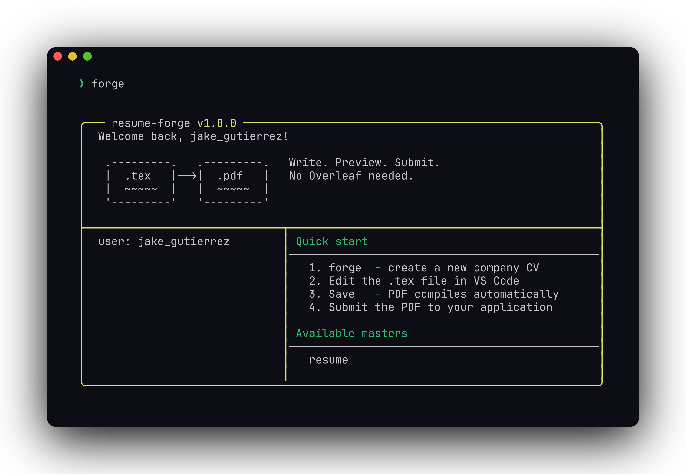

# resume-forge

[](https://github.com/shekar-raja/resume-forge/stargazers)
[](https://opensource.org/licenses/MIT)

> **Stop paying for Overleaf.** Write your CV in LaTeX, preview it live in VS Code, and submit a polished PDF — all offline, all free.

Built for developers and job seekers who want full control over their CV without a subscription. One command creates a company-specific CV from your master template. Save, preview, submit.



---

## What is LaTeX?

LaTeX (pronounced *"lah-tech"*) is a document preparation system widely used for creating clean, professional documents. Instead of a visual editor like Word, you write plain text with formatting instructions, and LaTeX compiles it into a polished PDF.

**Why use it for your CV?**
- Pixel-perfect, consistent formatting every time
- Plain text files — easy to version control with Git
- No subscription, no internet required, completely free
- ATS-friendly output (readable by applicant tracking systems)
- Used widely in academia, engineering, and tech

---

## Starting point

This kit uses [Jake Gutierrez's resume template](https://github.com/jakegut/resume) as the base — a clean, ATS-friendly single-page LaTeX CV with 5k+ stars.

**Get started in seconds:**
1. Download `resume.tex` from [jakegut/resume](https://github.com/jakegut/resume)
2. Replace the content with your own details
3. Save it as `masters/master_cv.tex`
4. Run `forge` and you're ready to apply

---

## Multiple master CVs

One of the most powerful features of this kit — **you can have as many master CVs as you want**, one per role type.

For example if you're applying to both engineering and data roles:

```
masters/
├── master_software_engineer.tex
├── master_data_engineer.tex
└── master_product_manager.tex
```

Each is just a copy of your base template with different content emphasised. When you find a job, pick the right master and create a tailored company copy in one command.

---

## How it works

```
resume-forge/
├── masters/
│   └── master_cv.tex               ← your base CV (add as many as you need)
├── companies/
│   └── Spotify/
│       ├── john_doe_cv.tex         ← customised copy for this company
│       └── john_doe_cv.pdf         ← auto-generated on every save
├── .vscode/
│   └── settings.json
├── forge.sh
└── README.md
```

1. Keep one or more **master CVs** in `masters/` — one per role type
2. Find a job → run one command to create a company-specific copy
3. Edit in VS Code → PDF previews live side-by-side as you type
4. Submit the PDF directly from the company folder

---

## Setup

### 1. Install TinyTeX

TinyTeX is a lightweight LaTeX engine (~100MB) — far smaller than a full LaTeX install.

**Mac/Linux:**
```bash
curl -sL "https://yihui.org/tinytex/install-bin-unix.sh" | sh
```

**Windows:** Download the installer from [yihui.org/tinytex](https://yihui.org/tinytex/).

Add TinyTeX to your PATH. On Mac/Linux, add this to your `~/.zshrc` or `~/.bashrc`:

```bash
export PATH=$PATH:~/.TinyTeX/bin/universal-darwin   # Mac
export PATH=$PATH:~/.TinyTeX/bin/x86_64-linux       # Linux
```

Reload your shell:
```bash
source ~/.zshrc
```

Install the required LaTeX packages:
```bash
tlmgr install preprint marvosym enumitem titlesec fancyhdr collection-latexrecommended
```

### 2. Install VS Code

Download from [code.visualstudio.com](https://code.visualstudio.com) if you don't have it.

### 3. Install LaTeX Workshop

In VS Code press `Cmd+Shift+X` (Mac) or `Ctrl+Shift+X` (Windows/Linux), search **LaTeX Workshop** by James Yu, and install it.

> If you have the **vscode-pdf** extension installed, disable it — it conflicts with LaTeX Workshop's built-in PDF viewer.

### 4. Clone this repo and open it in VS Code

```bash
git clone https://github.com/shekar-raja/resume-forge.git
cd resume-forge
code .
```

### 5. Fill in config.yml

```bash
cp config.example.yml config.yml
```

Open `config.yml` and set your name:

```yaml
user_name: john_doe
shell_config: ~/.zshrc
```

### 6. Run setup

```bash
./setup.sh
```

This auto-detects pdflatex and VS Code, updates `.vscode/settings.json`, and adds the `forge` alias to your shell. Then reload:

```bash
source ~/.zshrc
```

---

## Usage

### Set up your master CV

1. Download `resume.tex` from [jakegut/resume](https://github.com/jakegut/resume)
2. Fill in your details (name, experience, skills, education)
3. Save it as `masters/master_cv.tex`

Want multiple variants? Just create more files in `masters/` — one per role type.

### Create a CV for a new company

```bash
forge
```

The interactive prompt will ask for the company name and let you choose from your available master CVs. It then creates `companies/Spotify/username_cv.tex` copied from your chosen master and opens it in VS Code automatically.

### Edit and preview side by side

1. Edit the `.tex` file in VS Code
2. Press `Cmd+S` (Mac) or `Ctrl+S` (Windows/Linux) — PDF compiles automatically
3. Click **View LaTeX PDF** button (top right toolbar) — live PDF preview opens in a split panel right next to your editor

### Submit

Your compiled PDF is at `companies/Spotify/john_doe_cv.pdf` — attach it directly to your application.

---

## Tips

- **Never edit your master for a specific application** — always work in the company folder so your master stays clean
- Commented-out lines in the template (starting with `%`) are sections you can toggle on/off without deleting
- The `.tex` file is plain text — use `git diff` to see exactly what changed between versions
- Keep one folder per application so you always have a record of what you sent

---

## Contributing

PRs welcome! Ideas for contributions:
- Additional master CV templates for different roles
- Windows support (setup.sh and forge.sh currently target Mac/Linux)
- A `docs/preview.png` screenshot showing the VS Code split view

---

## Related

- [jakegut/resume](https://github.com/jakegut/resume) — the LaTeX template this kit is built around
- [LaTeX Workshop](https://github.com/James-Yu/LaTeX-Workshop) — the VS Code extension powering the live preview
- [TinyTeX](https://yihui.org/tinytex/) — the lightweight LaTeX engine used here

---

## License

MIT
